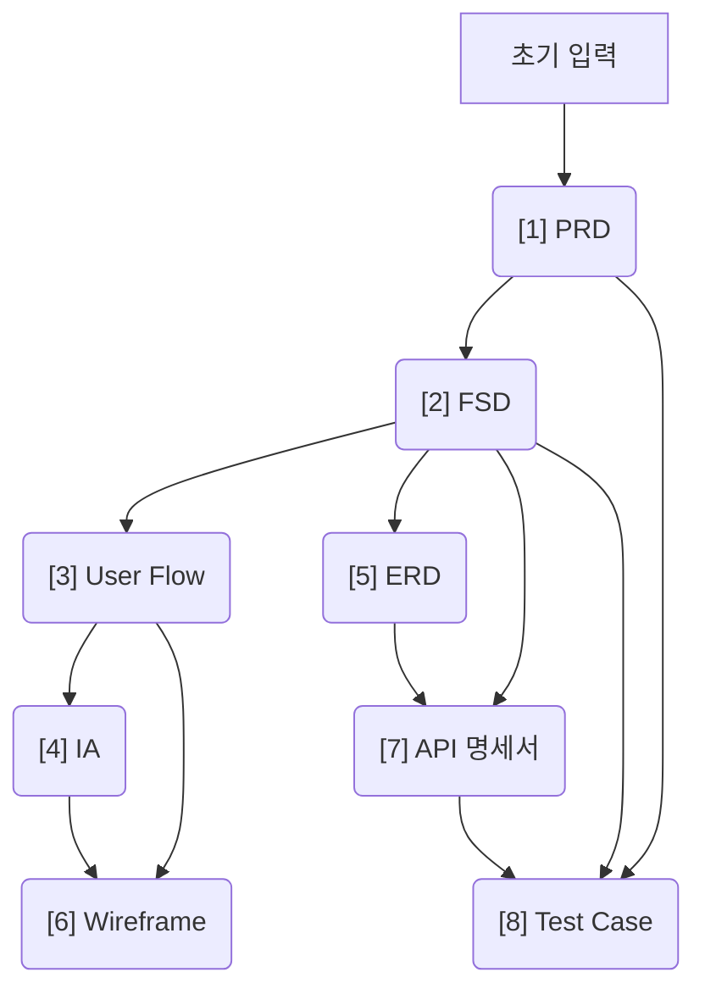

# Magic Planner 사용자 매뉴얼 (User Manual)

본 매뉴얼은 사용자 입력에 기초하여 8종의 소프트웨어 기획/아키텍처 산출물을 자율적으로 생성 및 검증하고, 변경사항 발생 시 단방향 비순환 그래프(DAG) 기반의 의존성 추적을 통해 안전하게 수정할 수 있도록 돕는 **Magic Planner(매직 플래너)**의 종합 가이드라인입니다.

---

## 1. Magic Planner 개요 (Overview)

**Magic Planner**는 데스크톱 설치형 소프트웨어 기획 오케스트레이터입니다. 사용자가 기본적인 프로덕트 아이디어를 제공하면, 사전에 설계된 산출물 단방향 비순환 그래프(DAG)의 의존성 흐름에 따라 기획 및 아키텍처 설계를 완성합니다.

### 1.1 핵심 가치 (Core Values)
1. **하향식 데이터 정합성 (Data Consistency):** 선행 산출물의 분석 결과(예: PRD)가 후행 산출물(예: FSD, ERD)의 생성 컨텍스트로 강제 피딩되어 정합성을 유지합니다.
2. **자가 검증 루프 (Self-Evaluation):** AI Generator가 생성한 산출물을 AI Evaluator가 평가 지표(Rubric)에 따라 채점(0~100점)하고 피드백을 전달하여 완성도를 극대화합니다.
3. **보안 및 BYOK (Bring Your Own Key):** 사용자가 직접 발급한 API 키를 로컬 스토리지에 암호화하여 저장하며, 외부 중앙 서버 없이 Google Gemini API와 직접 통신합니다.

### 1.2 산출물 의존성 관계 (DAG Specification)
Magic Planner는 아래와 같은 순서로 총 8종의 산출물 노드를 처리합니다.

---

## 2. 초기 설정 가이드 (Getting Started)

Magic Planner를 처음 실행하면 AI 코어를 작동하기 위한 환경 설정이 진행됩니다.

### 2.1 Gemini API Key 등록
1. **API 키 발급:** [Google AI Studio](https://aistudio.google.com/app/apikey)에 접속하여 Google 계정으로 로그인한 뒤, API 키를 생성하고 복사합니다.
2. **API 키 입력:** Magic Planner 설정 화면의 `Gemini API Key` 필드에 복사한 키를 붙여넣습니다.
3. **테스트 및 저장:** 우측의 `Test` 버튼을 클릭하여 연결 상태가 정상인지 확인합니다. `API Key is valid. Connection successful.` 메시지가 나타나면 하단의 `Save Preferences` 버튼을 눌러 설정을 완료합니다.

> [!IMPORTANT]
> Magic Planner는 로컬 기반의 BYOK 아키텍처를 따르므로, API Key를 외부 서버나 팀 공유 채널에 노출하지 마십시오. 모든 키 데이터는 로컬 스토리지(`settings.json`) 내에만 존재합니다.

---

## 3. 프로젝트 생성 가이드 (Creating a Project)

대시보드 화면에서는 전체 프로젝트 요약 정보를 확인하고, 새로운 기획 프로젝트를 시작할 수 있습니다.

### 3.1 새 프로젝트 생성 단계
1. 대시보드 우측 상단의 `New Project` 버튼을 클릭합니다.
2. **Step 1: Project Details**
   - **Project Name:** 설계하고자 하는 프로젝트의 이름(예: E-commerce API Gateway)을 입력합니다.
   - **Description (Optional):** 서비스에 대한 기초 아이디어, 목표 고객 및 비즈니스 목적을 작성합니다. 이 정보는 최초 `[1] PRD` 생성의 핵심 소스가 됩니다.
3. **Step 2: Select Execution Mode**
   - **AUTO 모드 (권장):** AI 에이전트가 각 산출물 간의 연결 및 생성 완료를 실시간으로 모니터링하여, 통과 기준 충족 시 후행 노드로 자동으로 전환을 제어하는 자율 모드입니다.
   - **MANUAL 모드:** 노드가 완료될 때마다 사용자가 사후 검토(HITL) 단계를 확인하고 수동으로 `Next Step`을 클릭해야 하는 제어 모드입니다.

---

## 4. 워크스페이스 상세 사용법 (Workspace UI & Usage)

워크스페이스는 기획 문서의 생성 흐름을 모니터링하고 수정 및 보완하는 통합 개발 환경(IDE)입니다.

### 4.1 주요 패널 구성
* **좌측 탐색기 (Sidebar Explorer):**
  - 현재 프로젝트 파이프라인 단계 및 모듈 계층을 보여줍니다.
  - 개별 노드명 앞의 아이콘은 해당 노드의 현재 상태를 직관적으로 제공합니다.
    - `PENDING` (점선 원): 실행 대기 상태
    - `READY` (파란색 재생 아이콘): 실행 가능 상태
    - `IN_PROGRESS` (초록색 반짝이는 점): 현재 생성/평가 중
    - `COMPLETED` (녹색 체크마크): 통과 기준 점수를 도출하여 최종 완료된 상태
    - `STALE` (주황색 전등): 상위 노드 변경으로 인해 무결성이 깨진 재생성 필요 상태
    - `PAUSED_HITL` (주황색 일시정지): 평가 임계치 점수 미달로 정지된 상태
* **중앙 에디터 패널 (Editor Panel):**
  - **헤더 컨트롤:** 노드별 최대 시도 횟수(`max_iterations`) 조절 및 `Start` / `Stop` / `Regenerate` / `Next Step` 등 파이프라인 제어 명령을 실행합니다.
  - **드래프트 탭:** 각 이터레이션에서 생성된 여러 버전의 산출물을 탭으로 스캔하고 정적/Markdown 미리보기 방식으로 읽어볼 수 있습니다.
* **하단 시스템 로그 (System Log):**
  - AI 에이전트 간의 프롬프트 체이닝, API 호출 결과, Evaluator의 평가 점수(Calculated Score) 및 세부 개선 피드백을 실시간 텍스트 스트리밍으로 출력합니다.
* **우측 정보 및 아키텍처 정제 패널 (Right Panel):**
  - **Properties 탭:** 선택한 노드의 상세 데이터(ID, 최신 상태, 스코어 상승 그래프, 보존된 이터레이션 백업 목록)를 조회합니다.
  - **Refine 탭:** 이미 빌드된 산출물에 특정 신규 기능을 추가하거나 수정을 적용하기 위한 하이브리드 컨텍스트 정제 엔진이 활성화됩니다.

---

## 5. 아키텍처 정제(Refinement) 프로세스 상세 가이드

프로젝트 구축이 완료된 상태에서 요구사항 변경이 있을 때, Magic Planner는 전면 재생성 대신 **영향 범위 의존성 추적 및 국소 패치(Taint Cascade & Differential Update)** 시스템을 가동합니다.

### 5.1 아키텍처 정제 5단계 파이프라인 흐름
1. **의도 추출 (Intent Extraction):**
   - 우측 `Refine` 탭의 입력창에 자연어로 수정 요청(예: "결제 모듈에 JWT 인증 절차 추가")을 입력하면 AI가 수정의 성격(ADD/MODIFY/DELETE)과 키워드를 분석합니다.
2. **아키텍처 라우팅 (Architecture Target Routing):**
   - AI가 PRD 요약본과 SAD 전역 명세를 바탕으로, 수정 요구사항의 **진입점이 되어야 할 최소 타겟 노드(Minimum Target Set)**를 결정합니다.
3. **사전 검증 (Pre-flight Check):**
   - Global Validator Agent가 비기능적 제약, 기술 스택, 인증 규격 등 시스템 전반의 핵심 규칙 위배 여부를 교차 검증합니다.
   - 결과가 **PASS**인 경우 다음 단계를 진행하며, **FAIL**인 경우 충돌 사유를 제시하고 즉시 중단합니다. **REFACTORING**으로 판정되면 광범위한 리팩토링 영향에 따른 HITL 승인 팝업이 활성화됩니다.
4. **상태 전이 및 부분 수정 (Taint Cascade & Bounded Traversal):**
   - 의존성 그래프에 따라, 직접 수정되는 타겟 노드의 하위 도메인들을 식별하여 자동으로 `STALE` 상태로 전이(Taint)시킵니다.
   - 이후 Micro-RAG 기술을 활용해 물리적 변경이 가해지는 세부 속성(Property) 구역만 타겟팅하고, 전체 노드를 다시 쓰지 않고 부분 패치(JSON Patch RFC 6902 유사 방식) 연산을 수행해 무결성을 유지합니다.
5. **사후 정합성 검사 및 최종 커밋 (Evaluation & Global Commit):**
   - `STALE` 상태로 변경되어 아티팩트 보완이 끝난 개별 노드들을 위상 정렬 순서에 맞게 검증(Evaluation)합니다. 모든 영향 노드가 검토 및 확정(`REVIEWED` 또는 `COMPLETED`)되면 최종 반영(`Finalize`)을 선언하여 정제 프로세스를 마감합니다.

---

## 6. FAQ 및 트러블슈팅

### Q1. API Key 등록 시 연결 테스트에 실패합니다.
- 복사한 Gemini API 키의 양 끝에 공백 문자나 개행 문자가 섞여 들어가지 않았는지 확인하세요.
- 네트워크가 Google AI Studio 서버에 정상적으로 접근할 수 있는 환경(방화벽 등 차단 여부)인지 점검하십시오.

### Q2. 특정 노드의 상태가 `PAUSED_HITL`로 멈추고 파이프라인이 중단되었습니다.
- **원인:** AI Generator가 여러 번(기본 10회) 생성 및 갱신을 반복했으나, AI Evaluator의 통과 커트라인(Threshold Score)을 충족하는 최적본 도출에 실패한 상태입니다.
- **해결 방안:**
  1. 에디터 헤더 영역의 `max_iterations`를 1~2회 추가 조정하여 재생성 시도를 늘려봅니다.
  2. 에디터 탭 내에서 에이전트의 이전 회차 개선 피드백(Actionable Feedback) 내용을 읽고, 해당 부분을 우측 `Refine` 탭에 구체적인 가이드 형식으로 지시("~ API 파트를 상세히 구체화하여 생성해 줘")하여 부분 수정을 강제 트리거합니다.

### Q3. 정제(Refinement) 요청 시 `FAIL (Hard Block)` 경고가 노출됩니다.
- 사용자의 수정 의도가 기술 스택 명세(`sad_tech_stack`)나 RBAC 권한 규격(`sad_auth_rbac`) 등 전역 시스템 통제 원칙을 명백히 침해하고 있을 가능성이 높습니다.
- 요청한 자연어 프롬프트 내에 전역 설계를 파괴할 만한 기술 혼용("기존 Node.js 환경에서 Go 언어로 특정 모듈 개발")이 포함되어 있는지 재점검하십시오.
